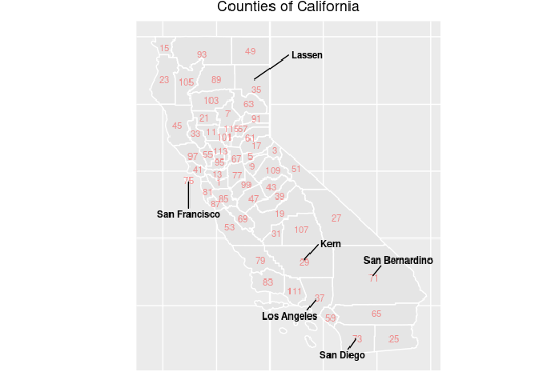
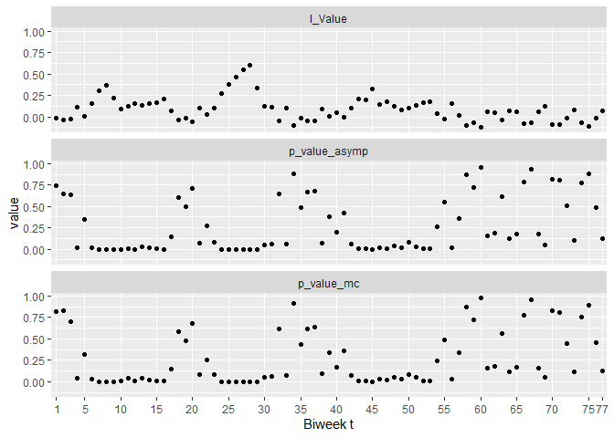

<script type="text/x-mathjax-config">
MathJax.Hub.Config({
  TeX: { 
      equationNumbers: {
 
            autoNumber: "all",
            formatNumber: function (n) {return +n}
      } 
  }
});
</script>


# Models Using Areal Data
In this section we will give a brief description of spatial models, and describe processes  which will eventually allow us to describe the Besag-York-Mollie model and its extensions.
An in depth introduction to many of the R related concepts we will discuss here is in [Crime Mapping Textbook](https://maczokni.github.io/crime_mapping_textbook/) 

We will first discuss Moran's I which provides an exploratory test for spatial relations. This is to be followed by a discussion involving the modeling of joint probability of spatial effects $\phi$. In addition we will illustrate how to prepare the data for STAN. 

# Moran's I 
When determining the presence of spatial relationships, a first step will be to determine whether there is reason to suspect that data that is in close proximity shows a recognizable pattern such that data which are closer to each other are more similar than data that are further apart. There are different frameworks in constructing spatial models. In this project we are interested in using areal data to create this framework.

Areal data, can be defined as data which is observed within well defined boundaries. For instance, square grids, zip code tabulation areas, or as in our project, counties in a particular state are all examples of well defined boundaries. Once we decide to use Areal data we need to assume a neighborhood structure. Figure 1 below will help illustrate this process. 


<figure><figcaption></figcaption></figure>
<a name="cal_map"></a><span style="color:white; text-align:center; display:inline-block; width:100%;">Figure 1: FIPS numbers are recorded on each county</span>

Turn your attention to San Bernardino. It is surrounded by counties with Federal Information Processing Standard (FIPS) codes 27, 29, 37, 59, 65. These in turn are effected by other counties. Therefore there is a need to define what constitute a neighbor for a county and the weight of that neighborhood. These are all questions that can be quantified via a neighborhood matrix. There are different schemes in literature. However the Bayesian model that will follow is rather rich in terms of parameters we will use a binary neighborhood structure where if a county shares a border with another county its' effect is to be estimated. We will explain how to create and represent this matrix in STAN. Based on the neighborhood structure one of the first things to do would be to determine whether there is any spatial effects to model.


Moran's I is an exploratory index for spatial correlation and has a range between -1 and 1.   
Per @banerjee2003hierarchical Moran's I and its variance is;
\[
I=\frac{N}{W}\frac{\sum_{i}\sum_{j}(y_{i}-\bar y)(y_{j}-\bar y)}{(y_{i}-\bar y)^{2}}
\label{eq:I}
\]
\[
Var(I)=\frac{n^{2}(n-1)S_{1}-n(n-1)S_{2}-2S_{0}^{2}}{(n+1)(n-1)^{2}S_{0}^{2}}
\label{eq:VarI}
\]
where
\[
S_{0}=\sum_{i \ne j} w_{ij}, S_{1}=\frac{1}{2}\sum_{i \ne j}(w_{ij}+w_{ji})^{2},S_{2}=\sum_{k} \left( \sum_{j} w_{kj} + \sum_{i} w_{ik} \right)^{2}
\]
where;

N is the number of areal components. (58 in California)

W is the sum of weights in the neighborhood weight matrix (58).

$y_{i}$ is the quantity of interest in areal unit i.

$\bar y$ is the mean quantity.
Under the null hypothesis that there is no spatial correlation the expected Moran's I value would be equal to
\[E(I)=\frac{-1}{n-1}
\label{eq:EI}
\]
Once we have \eqref{eq:I}, \eqref{eq:VarI}, and \eqref{eq:EI} we can calculate a z score via
\[z=\frac{(I-E(I))}{\sqrt{(Var(I))}}
\label{eq:z}\]

and assuming Central Limit Theorem applies a hypothesis test can be performed. Per @banerjee2003hierarchical as convergence to normal distribution is harder for ratio of quadratic values, a large set of permutations involving areal units that lead to simulated Moran's I values can be obtained for more robust results. A new I value would be calculated for each areal permutation and the original I value can be compared against the randomly permuted areal units' I values. 

In understanding how this all works we need to look at some r code.


```r
library(spdep)
library(spatialreg)
library(spatial)
library(tidyr)
library(ggplot2)
setwd("C:/Users/rm84/Desktop/research/HMM/data")
load("workspacewithbasedata.RData")
cnames=read.table("countynames.txt",sep="\t",header=TRUE)
```


```r
#shapeanddata is a simple features class object that contains 
#spatial information and county level feature information. 
#The poly2nb function creates the neighbor indexes 
nb_CA = poly2nb(shapeanddata)
#The neighbour indexes of county 1 in California (Alameda)
nb_CA[1]
```

```
## [[1]]
## [1]  7 38 39 41 43 50
```

```r
#The nb2listw function will create a the weight list of neighbors for each county 
#Each neighboring county's weight is equally weighted. 
#Therefore the sum of all weights in each row is 1 and the sum of all weights 
#is the number of counties in California (58).     
colw <- nb2listw(nb_CA, style="W")
#Gives the list of weights for Alameda 1/N_{1} where N_{1} is the number of 
#Alameda neighbors. 1/length(nb_CA[1]) == 1/6
colw$weights[1]
```

```
## [[1]]
## [1] 0.1666667 0.1666667 0.1666667 0.1666667 0.1666667 0.1666667
```

We are going to set up some objects to calculate not just the I value but p value via 

1.  Hypothesis testing based on Central Limit Theorem. 
2.  Areal Unit Permutation. 

Note that the quantity of interest in our application is SMR of Covid-19 mortality rather than Covid-19 mortality itself. We find that this is more realistic to determine whether spatial structure exists as there are large fluctuations in Covid-19 mortality due to differences in population size. 


```r
#Number of permutations for 2. Areal Unit Permutation.
nsim <- 5000
#Random number seed
set.seed(1234)
# Number of Biweeks below N is the total number of counties in CA 58.
NumBiWeeks=77
#SMR is standardized mortality ratio observed/expected
SMR=array(dim=c(NumBiWeeks,N))
#Since E is calculated based on aggregate mortality in California and population size of each county SMR is better for investigating whether there is a spatial structure.
SMR=y/exp(log_E)
```

We already discussed how to calculate I in \eqref{eq:I}. Z score can be calculated via \eqref{eq:z}. We have 77 biweeks and for each biweek we are going to calculate 2 sets of p values associated with the Moran's I scores and visualize them across this time series. The objects, sim_pvalue and asympt_pvalue are going to contain the p values associated with permuted spatial neighborhoods and central limit theorem is assumed to hold, respectively. Since we hypothesize that like values are clustered together the p values are going to be calculated via $P(Z>z)$.     


```r
#Object where p values are calculated based on spatial neighborhood permutations
sim_pvalue=array(dim=c(NumBiWeeks))
#Object where p values are calculated based on assuming Central Limit Theorem applies
asympt_pvalue=array(dim=c(NumBiWeeks))
#Object that holds Moran's I values.
Ivalue=array(dim=c(NumBiWeeks))
#Hypothesis tests are directional as discussed above. The hardcoded values 58 can be parameterized to generalize. n stands for number of units S0 stands for total weight in the neighbourhood matrix. W and S_0 will have the same values.
for(i in 1:NumBiWeeks){
sim_pvalue[i]<-moran.mc(SMR[i,], listw=colw, nsim=nsim, alternative="greater")$p.value
asympt_pvalue[i]<-moran.test(SMR[i,],colw, alternative="greater", zero.policy=TRUE)$p.value
Ivalue[i]<-moran(SMR[i,],colw,n=58,S0=58)$I
}
#Number of hypothesis tests that have p values less than 0.05 (our pick of alpha)
sum(sim_pvalue<0.05)
```

```
## [1] 28
```

```r
sum(asympt_pvalue<0.05)
```

```
## [1] 31
```

```r
#Create a data frame to contain the created values 
moransdf=as.data.frame(matrix(nrow=NumBiWeeks,ncol=4))
moransdf[,1]=sim_pvalue
moransdf[,2]=asympt_pvalue
moransdf[,3]=Ivalue
moransdf[,4]=c(1:NumBiWeeks)  
#Name each column
names(moransdf)=c("p_value_mc","p_value_asymp","I_Value","Biweek")

#Create a data frame which will have 3 columns
#Biweek, the names which has the labels in quotes and the numbers recorded under #value 
moransdf_long <-moransdf %>% pivot_longer(c("p_value_mc","p_value_asymp","I_Value"),names_to = "names")
#Visualizing the values
ggplot(moransdf_long, aes(x=Biweek, y=value))+
geom_point(stat="identity")+
facet_wrap(~names,  ncol=1)+
scale_x_discrete(limits=c(1,5,10,15,20,25,30,35,40,45,50,55,60,65,70,75,77))+
xlab("Biweek t")
```

<figure><figcaption></figcaption></figure>

As we can see from the visualization of p values and the number of them below the arbitrary but often used alpha value of 0.05, that for majority of the time periods we can not refuse the null hypothesis that there is no spatial correlation in the areal units. On the other hand in nearly 30 of the biweeks the p values are less than 0.05 and after all, the I value is an exploratory measure.  We will describe building the spatial model in the next section.     

# The Joint Spatial Effect $\phi$

Once we determine what counts as a neighbor and that there is a spatial effect to account for, we will need to decide how to account for it. In doing so we will need to define 

\begin{equation}
P(\phi_{1},\ldots,\phi_{N}), 
\label{eq:joint} 
\end{equation}
where N is the number of areal units (i.e.: 58 counties in CA).
Writing this form is not trivial. Furthermore, if we want to take into account spatial relations, it is clear that this will not happen via $P(\phi_{1}) \times \ldots \times P(\phi_{N})$. It is standard in Bayesian applications to obtain this joint form from full conditional probabilities. However as @banerjee2003hierarchical discusses, these conditional probabilities can not be arbitrary and demonstrates the form they need to take to create a valid joint probability distribution \eqref{eq:joint}.    

## Markov Random Fields (MRFs)
Markov Random Fields (MRFs), a special stochastic process, provides an important method to create this joint distribution from conditional distributions. 
A good description of these mechanisms are described in @besag74 and @cressie2015statistics and an introductory set of illustrations can be [found here.](https://ermongroup.github.io/cs228-notes/representation/undirected/) MRFs, a set of random numbers, can be represented as undirected graphs with specific conditional independence properties. The main advantage of using MRFs is being able to use  spatial effect probabilities conditional on neighborhood structure rather than using all areal units in order to create the joint probability distribution.   


We will give a very brief introduction to these mechanism by first describing the term clique within the context of spatial analysis. We can define a clique as a set of areal units where each unit is a neighbor to all in the clique. For instance in figure Figure 1 Kern, Los Angeles, Ventura (County FIPS == 111) form a clique since they all share a boundary with each other. This is also the maximal clique since it is not a subset of another clique. 

Using MRFs' [properties](https://www.cs.cmu.edu/~16831-f14/notes/F11/16831_lecture07_bneuman.pdf) and their relationship to Gibbs distributions (Fields) we can use quadratic potentials between areal units to come up with the joint probability of all areal units.

\begin{equation}
p(\mathbf{\phi})=p(\phi_{1},\ldots,\phi_{N})=
\frac{1}{Z}exp\bigg[-\sum_{c_{i}\epsilon C}f_{i}(c_{i})\bigg],
\label{eq:cliques}
\end{equation}

where $c_{i}$ is 2 member cliques, $i$ is going to go from 1 to the total number of unique pairwise cliques and Z is a normalizing constant. We will expand more on this as we detail the code. For instance there is clique of county FIPS 29 (Kern) and 71 (San Bernardino). The function $f_{i}$, potentials between spatial areas will be based on squared differences on $\phi$ terms leading to the result; 
\begin{equation}
-\frac{1}{2} \sum (\phi_{i}-\phi_{j})^2
\label{eq:sqrddif}
\end{equation} 

where the index $i$ and $j$ are neighbors that form the clique. The detailed assumptions and restrictions given by @besag74 allow the normal distribution to describe the uncertainty in the joint distribution of $\phi$.  

In the [link](https://mc-stan.org/users/documentation/case-studies/icar_stan.html) we can see the linear algebra that shows the derivation of the potential function via the assumption of multivariate normal distribution with a mean of 0 for the joint probability of $\phi$. Note that the mean of 0 for $\phi$ is to ensure an identifiable joint distribution. Further discussion will await the code.

## Preparing the Areal Data for STAN

First we are going to create a neighborhood list using the poly2nb function from the spdep package.   

```r
nb_CA = poly2nb(shapeanddata)
print(nb_CA)
```

```
## Neighbour list object:
## Number of regions: 58 
## Number of nonzero links: 288 
## Percentage nonzero weights: 8.561237 
## Average number of links: 4.965517
```

We obtain some information regarding our spatial object (graph object), namely that there are 58  areal units (counties) 144 shared borders. This means in a neighborhood 58 by 58 matrix, with (3364) cells, 144 of the cells will have a non zero value. 
Furthermore the nb_CA object will contain neighborhood structure between counties. For instance; 

```r
nb_CA[[1]]
```

```
## [1]  7 38 39 41 43 50
```
Shows that the first county 1,(Alameda) shares borders with counties 7 (Contra Costa), 38 (San Francisco), 39 (San Joaquin), (41 San Mateo), (43 Santa Clara) and (50 Stanislaus).

The pairwise cliques (neighbors) is obtained in r via the nb_data_funs functions provided by Mitzi Morris via the [github site](https://github.com/stan-dev/example-models/blob/master/knitr/car-iar-poisson/nb_data_funs.R). Among the many functions the author provides, an important one we will use is nb2graph.   


```r
nbs=nb2graph(nb_CA)

N = nbs$N
node1 = nbs$node1
node2 = nbs$node2
N_edges = nbs$N_edges
```

This function converts the spdep object into a form that will allow STAN to model the joint distribution of $\phi$. We will pass N as the number of areal units (counties) which is `r `nbs$N`. In addition node1 and node2 will contain information which will be used in computing $(\phi_{i} - \phi_{j})^2$.   

There are going to be 144 unique cliques (neighbor pairs), we will look at the first 10 such cliques below.

```r
node1[1:10]
```

```
##  [1] 1 1 1 1 1 1 2 2 2 2
```

```r
node2[1:10]
```

```
##  [1]  7 38 39 41 43 50  3  5  9 26
```
As described above county 1,(Alameda), has 6 listed neighbors in node 2 corresponding to county 1 in node 1, which can be seen in the R output above. 

Once the spatial and covariate data is prepared for STAN by combining them into a list, it is exported via the stan_rdump function as a text-file via rstan package.  


```r
dump=c('K','R','T','N','N_edges','node1','node2','log_E','y','x',
       'VacPop','medage','medsex','race',
       'scaling_factor','START','END')
#################################################
stan_rdump(dump, file = "C:/Users/rm84/Desktop/research/2023coviddata.r", append = FALSE,
           envir = parent.frame(),
           width = options("width")$width,
           quiet = FALSE)
```

# Besag York Mollie (BYM) Model
BYM model was first implemented in @besag1991bayesian which has a log linear Poisson likelihood. The original form of the distribution can be stated as;     

\begin{equation}
Y_{i} \sim Poisson(\lambda_{i}) \\
log(\lambda_{i}) = log(E_{i})  \times (\beta*X_{i}+\theta_{i}+\phi_{i}),  
\end{equation}

where $\phi$, areal spatial effect, has the form as described via \eqref{eq:sqrddif}. It will be a vector with N elements same as $\theta$, the specific random effects of the areal units. In this post we will ignore the original model and focus on the extended version

\begin{equation}
Y_{it} \sim Poisson(\lambda_{i}) \\
log(\lambda_{i}) = log(E_{i})  \times \left(\beta*X_{i}+\left(\sqrt{\frac{\rho}{s}}\times \phi_{i}+\sqrt{(1-\rho)}\times \theta_{i}\right)\times \sigma \right),  \end{equation}

* $\rho \in [0,1]$ controls the contribution of spatial vs random effects. If $\rho$ is 0, 
* s is the scaling factor which can be computed using the  and the function provided by once again Mitzi Morris and the [github site](https://github.com/stan-dev/example-models/blob/master/knitr/car-iar-poisson/nb_data_funs.R). The constant value is evaluated from the matrix $Q$ and for ICAR models it is equal to 
\[Q=D(I-A)\]
where 
* D is the N by N diagonal matrix with the number of neighbors for each areal unit.
* I is the N by N identity matrix. 
* A is the N by N adjacency matrix.  
Using these matrices as input, the function "scale_nb_components" calculates the geometric mean of the variances which are on the diagonal of $Q^{-1}$ matrix diagonal. This in turn ensures that the prior of $\phi$ will have a standard deviation of 1. We will also set the prior of $\theta$ as 1. This is necessary to be able to interpret $\sigma$ as the overall standard deviation of combined $\phi$ and $\theta$ terms.  

We will include a time component t which will modify the equation. For now we will focus on STAN program. 

## STAN program and BYM Original and Extended Version
In this section we explain how to setup and execute the Besag York Mollie model. Most of this section is paraphrased from [here](https://www.ncbi.nlm.nih.gov/pmc/articles/PMC6830524/), where the analysis is based on a single slice of time. The authors explain the original formulation for BYM which have convergence issues and propose a new solution. 

## STAN Function for $\phi$
An elaborate explanation of the function created in STAN for $\phi$ exists [here](https://mc-stan.org/users/documentation/case-studies/icar_stan.html#adding-an-icar-component-to-a-stan-model). 


```stan
functions {
  real icar_normal_lpdf(row_vector phi, int N, int[] node1, int[] node2) 
  {
    return -0.5 * dot_self(phi[node1] - phi[node2])
    + normal_lpdf(sum(phi) | 0, 0.0001 * N);
  }
          }
```

It should be noted here that the variable declared as sum of $\phi$ on the last line of the puts a soft constraint on the the mean of $\phi$ vector of 0 with a standard deviation of 0.0001. 

The data 

# References

