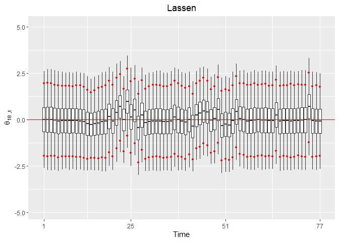
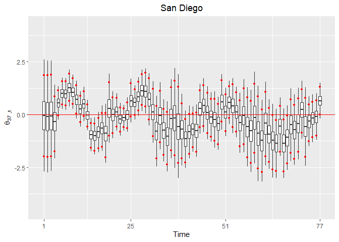

```{=html}
<script type="text/x-mathjax-config">
MathJax.Hub.Config({
  TeX: { 
      equationNumbers: {
 
            autoNumber: "all",
            formatNumber: function (n) {return +n}
      } 
  }
});
</script>
```


# Compiling and Running via cmdSTAN in UBUNTU
The first step in compiling our program is to navigate to the cmdstan file. 

```bash
cd /home/admin/cmdstan
```

We then have cmdstan turn our modelA1 into an executable program via the make command.


```bash
make /home/admin/Desktop/research/modelA1
```

Navigate to the folder where the modelA1.STAN has an executable file under the name modelA1.


```bash
cd /home/admin/Desktop/research/
```

While remaining in the same location, we instruct cmdstan to create 3 MCMC chains to run in parallel, do a 50,000 set of warmup simulations and sample 10,000 from them. The data is specified as '2023noICUcoviddata1.r' and the output files will be specified as mA11 with its extensions specified as _i leading to the file names mA11_1,mA11_2, and mA11_3. The execution of the model took approximately 9 hrs in hour workstation.


```bash
for i in {1..3}; do ./modelA1 sample num_warmup=50000
num_samples=10000 data file=./2023noICUcoviddata1.r 
output file output file=mA11_${i} &done&
```

# Reading the files and checking convergence

In this section we will read in the csv files and check for convergence. Note that the mA11_1,mA11_2 and mA11_3 do not have file extensions so we added them for convenience. The model created these large files and they will take a large RAM capacity in your R session.   


```r
#Loading the libraries and specifying the options to use multiple cores as needed
options(mc.cores=parallel::detectCores(),auto_write = TRUE)
library(rstan)
library(xtable)
library(ggspatial)
library(ggplot2)
library(viridis)
setwd("C:/Users/rm84/Desktop/research/HMM/data")
load("workspacewithbasedata.RData")
#Specifying the location of the csv files and creating string objects

chain1='C:/Users/rm84/Documents/mA11_1.csv'
chain2='C:/Users/rm84/Documents/mA11_2.csv'
chain3='C:/Users/rm84/Documents/mA11_3.csv'
```

To check for convergence we read in the csv files and obtain summary information of the MCMC samples. There is a good discussion on why we should not focus only on Rhat^[https://statmodeling.stat.columbia.edu/2019/03/19/maybe-its-time-to-let-the-old-ways-die-or-we-broke-r-hat-so-now-we-have-to-fix-it/] however we know that if Rhat is over 1.01 we definitely do not have a well mixed model. We show here that there were no parameters with an Rhat over 1.01 and proceed to also highlight the similarity between the observed mortality data and the generated values.  


```r
csvfiles=c(chain1,chain2,chain3)
fit=read_stan_csv(csvfiles)
fitsummary=summary(fit)$summary

Rhats=fitsummary[,"Rhat"]

sum(Rhats>1.01,na.rm=TRUE)
```

```
## [1] 0
```

```r
Rhats[Rhats>1.01]
```

```
## named numeric(0)
```

# Converting the samples to R object

We proceed to extract all the samples into the object listofdraws, remove the stan fit object, use the garbage collection gc() function to release RAM. Attaching the listofdraws allow us to refer to the parameters directly. 


```r
listofdraws=as.data.frame(rstan::extract(fit))
rm(fit)
gc()
```

```
##             used   (Mb) gc trigger    (Mb)   max used   (Mb)
## Ncells   1335422   71.4    2738254   146.3    2738254  146.3
## Vcells 428693197 3270.7 1427204501 10888.8 1297103381 9896.2
```

```r
#rho 
attach(listofdraws)
```

# Obtaining Root Mean Square Error and DIC4

The list of lists, object named 'cadata', contain all the data that our model have used. We will first obtain the root mean square error in rMSE object. We are going to utilize the $DIC_4$ framework from @celeux06 to calculate the fit our model to compare to others later. The result is contained in the object ll which we report.     


```r
source("C:/Users/rm84/Desktop/research/HMM/data/R2023noICUcoviddata1.r")
START=1
END=77
ITER=END-START+1
cadata$START=START
cadata$END=END

meansoflambda=array(dim=c(ITER,length=N))
for(t in START:END){
  for(n in 1:N){
    meansoflambda[t-START+1,n]=mean(eval(parse(text=(paste0("alpha.",t-START+1,".",1,".",n)))))
  }}

MSEarray=array(dim=c(ITER))
for(t in START:END){
  MSEarray[t-START+1]=mean((cadata$y[t,]-meansoflambda[t-START+1,])^2)
}
MSE=mean(MSEarray)
rMSE=sqrt(MSE)

rMSE
```

```
## [1] 1.660921
```

```r
l=length(alpha.1.1.1)
ll1=array(dim=c(l,(END-START+1),N))
for(t in START:END){
  for(n in 1:N){
    ll1[,t,n]=dpois(y[t,n],lambda=eval(parse(text=(paste0("alpha.",t-START+1,".",1,".",n)))),log=TRUE)
  }}

ll2=matrix(nrow=(END-START+1),ncol=N)
for(t in START:END){
  for(n in 1:N){
    ll2[t,n]=dpois(y[t,n],lambda=mean(eval(parse(text=(paste0("alpha.",t-START+1,".",1,".",n))))),log=TRUE)
  }}


ll=-4*mean(rowSums(ll1))+2*sum(ll2)

ll
```

```
## [1] 17724.42
```

# Analysis of parameters
This section will discuss the findings associated with modelA1. We will first discuss the fixed parameters of interest associated with the covariates. We will follow that with a discussion of coefficients of Vaccinations through $t=1 \ldots t=77$. We proceed to discuss $\phi$ and $\theta$ terms. 

## Parameters of Fixed Covariates

In this subsection we discuss the coefficients associated with covariates that are observed a single or 3 separate times effect mortality risk. We obtain Poverty, Income, Gini Sex Ratio  and Median Age figures for the counties of California for each of the years under purview. Our data has 25,26,26 biweeks in the years 2020, 2021 and 2022 respectively and as stated in the data section of the STAN model. All of this data are replicated across the biweeks. Race, and Density (Population/Land Area of County) are calculated via Decennial Census and therefore is a fixed value across all the biweeks. In order to limit the number of estimated parameters in the race variable we used proportion of white people, which have the largest median of race values, right under 50%,  as the median value in the 58 counties.


```r
summary1=xtable(summary((cbind.data.frame(beta_pov,
beta_inc,beta_dens,beta_gini,beta_white,beta_age,beta_sex))))

s1=(as.data.frame(cbind(beta_pov,beta_inc,beta_dens,beta_gini,
beta_white,beta_age,beta_sex)))

m1=as.data.frame(matrix(data=s1,nrow=6,ncol=7))

  m1[1,]=round(sapply(s1,min),3)
  m1[2,]=round(apply(s1[1:7],2,quantile,probs=0.025),3)
  m1[3,]=round(sapply(s1,median),3)
  m1[4,]=round(colMeans(s1),3)
  m1[5,]=round(apply(s1[1:7],2,quantile,probs=0.975),3)
  m1[6,]=round(sapply(s1,max),3)
  row.names(m1) = c("Min","2.5th Perc.","Med.","Mean","97.5th Perc.","Max")
knitr::kable(m1,
col.names = c("$\\beta_{Pov}$","$\\beta_{Inc}$","$\\beta_{Dens}$","$\\beta_{gini}$","$\\beta_{white}$","$\\beta_{age}$","$\\beta_{sex}$"),
escape=FALSE)
```


|             |$\beta_{Pov}$ |$\beta_{Inc}$ |$\beta_{Dens}$ |$\beta_{gini}$ |$\beta_{white}$ |$\beta_{age}$ |$\beta_{sex}$ |
|:------------|:-------------|:-------------|:--------------|:--------------|:---------------|:-------------|:-------------|
|Min          |-0.054        |-0.328        |0.025          |-0.152         |0.36            |-0.023        |-0.258        |
|2.5th Perc.  |0.017         |-0.248        |0.074          |-0.097         |0.677           |0.044         |-0.181        |
|Med.         |0.089         |-0.161        |0.112          |-0.041         |0.985           |0.122         |-0.113        |
|Mean         |0.089         |-0.162        |0.112          |-0.042         |0.984           |0.122         |-0.114        |
|97.5th Perc. |0.162         |-0.075        |0.149          |0.013          |1.289           |0.201         |-0.049        |
|Max          |0.231         |0.009         |0.184          |0.068          |1.678           |0.278         |0.014         |

As can be seen from the table's $95\%$ credibility intervals increased poverty, density, percentage of people who are white and median age leads to increased mortality risk assuming the model is correct. On the other hand increased income and males to females ratio in the county decreases mortality risk for the same assumption. When we control for all the covariates, Gini covariate coefficient contains the value 0 in the $95\%$ credibility interval. This is not very surprising since we are already controlling for Income and Poverty.


## Parameters of Vaccination Coefficients

As can be demonstrated from the plot in this section we can clearly see that in most of 2021 the vaccinations decreased mortality risk in the counties of california. The only biweek where vaccinations in the counties of California had a positive relationship to mortality risk is in biweek 62 which is in 2022. For all of the rest of 2022 the credibility interval contains 0. This acquires more attention and could be due to the vaccinations losing their effectiveness and most of the population having some degree of protection. As both the disease and the vaccinations are evolving we would need to pay close attention to the dynamic nature of these effects. In fact we argue that we should be looking at more changes in the fixed covariates' effect through the biweeks.     


```r
library(ggpubr)
library(dplyr)
library(gridExtra)

V=cadata$V
qhigh=array(dim=c(T-V+1))
qlow=array(dim=c(T-V+1))
beta_vac=as.data.frame(matrix(nrow=(T-V+1)*l,ncol=2))

for(i in 1:(T-V+1)){
  beta_vac[((i-1)*(l)+1):((i)*l),1]=eval(parse(text=(paste0("beta_vac.",i))))
  beta_vac[((i-1)*(l)+1):((i)*l),2]=i

}
names(beta_vac)=c("beta_vac","Biweeks")

qhigh_data <- beta_vac %>%
  group_by(Biweeks) %>%
  summarise(qhigh = quantile(beta_vac,0.975))

qlow_data <- beta_vac %>%
  group_by(Biweeks) %>%
  summarise(qlow = quantile(beta_vac,0.025))

  beta_vacplot=ggplot(data = beta_vac,aes(x= Biweeks, y = beta_vac,group=Biweeks))+
  geom_boxplot(outlier.shape = NA)+scale_y_continuous(name=bquote(beta[vac]))+ggtitle(bquote(beta[vac] ~ "from t=1...77"))+theme(plot.title = element_text(hjust = 0.5))+
  geom_hline(yintercept=0.0, linetype="solid", color = "red") +
  scale_x_continuous(name="Time",labels=c('25','29','34','39','44','49','54','59','64','69','74','77'),breaks=c(1,5,10,15,20,25,30,35,40,45,50,55))+
    stat_summary(data = qhigh_data, 
                 aes(x = Biweeks, y = qhigh),
                 geom = "point", 
                 size = 1, 
                 color = "red")+
    stat_summary(data = qlow_data, 
                 aes(x = Biweeks, y = qlow),
                 geom = "point", 
                 size = 1, 
                 color = "red")
beta_vacplot
```

<figure><figcaption></figcaption></figure>

```r
#Number of biweeks where 0 is above the Credibility Interval  
num_biweeks_CI_neg<-sum(0<qlow_data$qlow)   
num_biweeks_CI_neg
```

```
## [1] 1
```

```r
#What were the biweeks where 0 is above the Credibility Interval 
which(0<qlow_data$qlow)+V
```

```
## 2.5% 
##   63
```

```r
#Number of biweeks where 0 is below the Credibility Interval
num_biweeks_CI_pos<-sum(0>qhigh_data$qhigh)
num_biweeks_CI_pos
```

```
## [1] 28
```

```r
#What were the biweeks where 0 is below the Credibility Interval
which(0>qhigh_data$qhigh)+V
```

```
## 97.5% 97.5% 97.5% 97.5% 97.5% 97.5% 97.5% 97.5% 97.5% 97.5% 97.5% 97.5% 97.5% 
##    30    31    32    33    34    35    36    37    38    39    40    41    42 
## 97.5% 97.5% 97.5% 97.5% 97.5% 97.5% 97.5% 97.5% 97.5% 97.5% 97.5% 97.5% 97.5% 
##    43    44    45    46    47    48    49    50    51    52    53    55    56 
## 97.5% 97.5% 
##    57    58
```

## $\theta$, Random Effect Coefficients of Counties

We proceed to illustrate the random effects of counties. It is not surprising that for most counties, $\theta_{it}$ which can be referred to as the county performance varies across the biweeks per county. In the script below, the R object thetaXX is going to contain the MCMC samples from various counties. Per the rest of the project we are going to look in detail to 6 Californian counties. The XX values of the components are given in parenthesis after county names. Los Angeles (19), San Diego (37), San Francisco (38), Kern (15), Lassen (18) and San Bernardino (36).  We are following the random effects for 77 biweeks after we take into account the listed covariates as well as areal effects of the counties surrounding them. The posterior means and credibility intervals (CI) of this component are of special importance to policy makers as relatively high/low values should have them look into the root causes behind low/high increase in relative mortality risk.

In order to visualize the random effects via ggplot we will be creating data frame objects with M rows and 2 columns for each of the before mentioned counties. M is the number of MCMC samples multiplied by the biweeks. The first column is going to contain the MCMC values and the second column the biweek value. 

Each of the counties will have a ggplot associated with it that visualizes the boxplot of the MCMC samples for each biweek as well as the Credibility Interval (CI).    


```r
library(ggpubr)
library(gridExtra)
library(ggplot2)
library(tidyverse)

#Names of the 58 counties in alphabetical order.
cnames<-read.table("C:/Users/rm84/Desktop/research/HMM/data/countynames.txt",sep="\t",header=TRUE)[,1]

START=1
END=77
ITER=END-START+1
#We need the length of the object in order to create data matrices with correct dimension size.
l=length(theta.1.15)

#Below we have various thetaXX objects. These will contain all the MCMC samples associated with the random effect (unstructured errors) associated with county XX.
M=ITER*l
#County Name
cnames[15]
```

```
## [1] "Kern"
```

```r
#Object where all MCMC values of county 15 will be assigned
theta15=as.data.frame(matrix(nrow=M,ncol=2))


n=15
#First column for MCMC values 2nd column for biweek index
for(t in 1:ITER){
  theta15[((t-1)*(l)+1):((t)*l),1]=eval(parse(text=(paste0("theta.",t,".",n))))
  theta15[((t-1)*(l)+1):((t)*l),2]=t

}

names(theta15)=c("theta","Biweeks")

cnames[18]
```

```
## [1] "Lassen"
```

```r
theta18=as.data.frame(matrix(nrow=M,ncol=2))
n=18
for(t in 1:ITER){
  theta18[((t-1)*(l)+1):((t)*l),1]=eval(parse(text=(paste0("theta.",t,".",n))))
  theta18[((t-1)*(l)+1):((t)*l),2]=t
}

names(theta18)=c("theta","Biweeks")

####################

cnames[19]
```

```
## [1] "Los Angeles"
```

```r
theta19=as.data.frame(matrix(nrow=M,ncol=2))
n=19
for(t in 1:ITER){
  theta19[((t-1)*(l)+1):((t)*l),1]=eval(parse(text=(paste0("theta.",t,".",n))))
  theta19[((t-1)*(l)+1):((t)*l),2]=t
}

names(theta19)=c("theta","Biweeks")
#########################################

cnames[36]
```

```
## [1] "San Bernardino"
```

```r
theta36=as.data.frame(matrix(nrow=M,ncol=2))
n=36
for(t in 1:ITER){
  theta36[((t-1)*(l)+1):((t)*l),1]=eval(parse(text=(paste0("theta.",t,".",n))))
  theta36[((t-1)*(l)+1):((t)*l),2]=t
}

names(theta36)=c("theta","Biweeks")

###############################################
cnames[37]
```

```
## [1] "San Diego"
```

```r
theta37=as.data.frame(matrix(nrow=M,ncol=2))
n=37
for(t in 1:ITER){
  theta37[((t-1)*(l)+1):((t)*l),1]=eval(parse(text=(paste0("theta.",t,".",n))))
  theta37[((t-1)*(l)+1):((t)*l),2]=t
}

names(theta37)=c("theta","Biweeks")

#########################################

cnames[38]
```

```
## [1] "San Francisco"
```

```r
theta38=as.data.frame(matrix(nrow=M,ncol=2))
n=38
for(t in 1:ITER){
  theta38[((t-1)*(l)+1):((t)*l),1]=eval(parse(text=(paste0("theta.",t,".",n))))
  theta38[((t-1)*(l)+1):((t)*l),2]=t
}

names(theta38)=c("theta","Biweeks")

############################################################################################
#In this section of the code we record the values of upper and lower quantiles for each of the T biweeks
###
cnames[15]
```

```
## [1] "Kern"
```

```r
qhigh_datatheta15 <- theta15 %>%
  group_by(Biweeks) %>%
  summarise(qhigh_theta15 = quantile(theta,0.975))

qlow_datatheta15 <- theta15 %>%
  group_by(Biweeks) %>%
  summarise(qlow_theta15 = quantile(theta,0.025))

#############
cnames[18]
```

```
## [1] "Lassen"
```

```r
qhigh_datatheta18 <- theta18 %>%
  group_by(Biweeks) %>%
  summarise(qhigh_theta18 = quantile(theta,0.975))

qlow_datatheta18 <- theta18 %>%
  group_by(Biweeks) %>%
  summarise(qlow_theta18 = quantile(theta,0.025))

#############
cnames[19]
```

```
## [1] "Los Angeles"
```

```r
qhigh_datatheta19 <- theta19 %>%
  group_by(Biweeks) %>%
  summarise(qhigh_theta19 = quantile(theta,0.975))

qlow_datatheta19 <- theta19 %>%
  group_by(Biweeks) %>%
  summarise(qlow_theta19 = quantile(theta,0.025))

#################
cnames[36]
```

```
## [1] "San Bernardino"
```

```r
qhigh_datatheta36 <- theta36 %>%
  group_by(Biweeks) %>%
  summarise(qhigh_theta36 = quantile(theta,0.975))

qlow_datatheta36 <- theta36 %>%
  group_by(Biweeks) %>%
  summarise(qlow_theta36 = quantile(theta,0.025))
#############
cnames[37]
```

```
## [1] "San Diego"
```

```r
qhigh_datatheta37 <- theta37 %>%
  group_by(Biweeks) %>%
  summarise(qhigh_theta37 = quantile(theta,0.975))

qlow_datatheta37 <- theta37 %>%
  group_by(Biweeks) %>%
  summarise(qlow_theta37 = quantile(theta,0.025))
########################
cnames[38]
```

```
## [1] "San Francisco"
```

```r
qhigh_datatheta38 <- theta38 %>%
  group_by(Biweeks) %>%
  summarise(qhigh_theta38 = quantile(theta,0.975))

qlow_datatheta38 <- theta38 %>%
  group_by(Biweeks) %>%
  summarise(qlow_theta38 = quantile(theta,0.025))
#######################################################
#We will use the above objects in order to map ticks on the whiskers of the boxplots. These ticks correspond to the 97.5 the and 0.025 the percentiles in order to specify the location for the 95% Credibility Intervals. 

#Boxplots for
cnames[15]
```

```
## [1] "Kern"
```

```r
Kern=ggplot(data = theta15,aes(x= Biweeks, y = theta,group=Biweeks))+
  geom_boxplot(outlier.shape = NA)+ggtitle(cnames[15])+theme(plot.title = element_text(hjust = 0.5))+
  geom_hline(yintercept=0, linetype="solid", color = "red")+ylim(-5,5)+
  scale_y_continuous(name=bquote(theta[15~",t"]))+
  scale_x_continuous(name="Time",labels=c('1','25','51','77'),breaks=c(1,25,51,77))+stat_summary(data = qhigh_datatheta15,     aes(x = Biweeks, y = qhigh_theta15),
                 geom = "point", 
                 size = 1, 
                 color = "red")+
    stat_summary(data = qlow_datatheta15, 
                 aes(x = Biweeks, y = qlow_theta15),
                 geom = "point", 
                 size = 1, 
                 color = "red")

#######################################################
#Boxplots of theta for
cnames[18]
```

```
## [1] "Lassen"
```

```r
Lassen=ggplot(data = theta18,aes(x= Biweeks, y = theta,group=Biweeks))+
  geom_boxplot(outlier.shape = NA)+ggtitle(cnames[18])+theme(plot.title = element_text(hjust = 0.5))+
  geom_hline(yintercept=0, linetype="solid", color = "red")+ylim(-5,5)+scale_y_continuous(name=bquote(theta[18~",t"]))+
  scale_x_continuous(name="Time",labels=c('1','25','51','77'),breaks=c(1,25,51,77))+stat_summary(data = qhigh_datatheta18, 
                 aes(x = Biweeks, y = qhigh_theta18),
                 geom = "point", 
                 size = 1, 
                 color = "red")+
    stat_summary(data = qlow_datatheta18, 
                 aes(x = Biweeks, y = qlow_theta18),
                 geom = "point", 
                 size = 1, 
                 color = "red")

#####################
#Boxplots of theta for
cnames[19]
```

```
## [1] "Los Angeles"
```

```r
la=ggplot(data = theta19,aes(x= Biweeks, y = theta,group=Biweeks))+
  geom_boxplot(outlier.shape = NA)+ggtitle(cnames[19])+theme(plot.title = element_text(hjust = 0.5))+
  geom_hline(yintercept=0, linetype="solid", color = "red")+scale_y_continuous(name=bquote(theta[19~",t"]))+
  scale_x_continuous(name="Time",labels=c('1','25','51','77'),breaks=c(1,25,51,77))+stat_summary(data = qhigh_datatheta19, 
                 aes(x = Biweeks, y = qhigh_theta19),
                 geom = "point", 
                 size = 1, 
                 color = "red")+
    stat_summary(data = qlow_datatheta19, 
                 aes(x = Biweeks, y = qlow_theta19),
                 geom = "point", 
                 size = 1, 
                 color = "red")
#######################
#Boxplots of theta for
cnames[36]
```

```
## [1] "San Bernardino"
```

```r
sbern=ggplot(data = theta36,aes(x= Biweeks, y = theta,group=Biweeks))+
  geom_boxplot(outlier.shape = NA)+ggtitle(cnames[36])+theme(plot.title = element_text(hjust = 0.5))+
  geom_hline(yintercept=0, linetype="solid", color = "red")+ylim(-5,5)+
  scale_y_continuous(name=bquote(theta[36~",t"]))+
  scale_x_continuous(name="Time",labels=c('1','25','51','77'),breaks=c(1,25,51,77))+stat_summary(data = qhigh_datatheta36, 
                 aes(x = Biweeks, y = qhigh_theta36),
                 geom = "point", 
                 size = 1, 
                 color = "red")+
    stat_summary(data = qlow_datatheta36, 
                 aes(x = Biweeks, y = qlow_theta36),
                 geom = "point", 
                 size = 1, 
                 color = "red")

########################################
#Boxplots of theta for
cnames[37]
```

```
## [1] "San Diego"
```

```r
sd=ggplot(data = theta37,aes(x= Biweeks, y = theta,group=Biweeks))+
  scale_y_continuous(name=bquote(theta))+
  geom_boxplot(outlier.shape = NA)+ggtitle(cnames[37])+theme(plot.title = element_text(hjust = 0.5))+
  geom_hline(yintercept=0, linetype="solid", color = "red")+scale_y_continuous(name=bquote(theta[37~",t"]))+
  scale_x_continuous(name="Time",labels=c('1','25','51','77'),breaks=c(1,25,51,77))+stat_summary(data = qhigh_datatheta37, 
                 aes(x = Biweeks, y = qhigh_theta37),
                 geom = "point", 
                 size = 1, 
                 color = "red")+
    stat_summary(data = qlow_datatheta37, 
                 aes(x = Biweeks, y = qlow_theta37),
                 geom = "point", 
                 size = 1, 
                 color = "red")
########################################
#Boxplots of theta for
cnames[38]
```

```
## [1] "San Francisco"
```

```r
sf=ggplot(data = theta38,aes(x= Biweeks, y = theta,group=Biweeks))+
  scale_y_continuous(name=bquote(theta))+
  geom_boxplot(outlier.shape = NA)+ggtitle(cnames[38])+theme(plot.title = element_text(hjust = 0.5))+
  geom_hline(yintercept=0, linetype="solid", color = "red")+scale_y_continuous(name=bquote(theta[38~",t"]))+
  scale_x_continuous(name="Time",labels=c('1','25','51','77'),breaks=c(1,25,51,77))+stat_summary(data = qhigh_datatheta38,                 aes(x = Biweeks, y = qhigh_theta38),
                 geom = "point", 
                 size = 1, 
                 color = "red")+
    stat_summary(data = qlow_datatheta38, 
                 aes(x = Biweeks, y = qlow_theta38),
                 geom = "point", 
                 size = 1, 
                 color = "red")

#############################################################
```

Out of the 6 counties whose boxplots of $\theta$ vs biweeks we are looking into, the first county we will investigate is San Bernardino.


<figure><figcaption></figcaption></figure>

we see patterns of some note indicated by CI. In 2020 there is not a lot to note except the few biweeks in the middle of the year that suggests the reduction in mortality risk, which unfortunately turns to an increase in the last biweeks. For great majority of 2021 most of the credibility intervals contain the value 0. In the initial months of year 2022 that increased mortality risk which reverses direction in the latter moths. We can quantify the performance of the county by comparing the lower and upper bound values of the CI to 0. The lower (upper) bound value of CI being higher than 0 indicates higher (lower) relative mortality risk.   

Using the formulation 0 < 95% Lower Bound CI and summing up the number of biweeks we find that 6 of the times San Bernardino had higher relative risk. To find the number of biweeks with lower mortality risk we replace the 95% Lower Bound CI with 95% Upper Bound CI and change '>' to '<' which results in 8 number of biweeks.  Policy makers should look at these across time and investigate the reason behind this performance specific to the county, after accounting covariates and areal effects.   


```r
SanBernOutliers<-as.data.frame(matrix(nrow=2,ncol=3))

SanBernOutliers[1,1]<-sum(0>qhigh_datatheta36[1:25,2])
SanBernOutliers[1,2]<-sum(0>qhigh_datatheta36[26:51,2])
SanBernOutliers[1,3]<-sum(0>qhigh_datatheta36[52:77,2])

SanBernOutliers[2,1]<-sum(0<qlow_datatheta36[1:25,2])
SanBernOutliers[2,2]<-sum(0<qlow_datatheta36[26:51,2])
SanBernOutliers[2,3]<-sum(0<qlow_datatheta36[52:77,2])

row.names(SanBernOutliers) = c("Lower Risk","Higher Risk")
  
kable(SanBernOutliers,align="c",
col.names = c("  2020  ", "  2021  ", "  2022  "),caption=" The number of biweeks that the CI did not contain 0 indicating higher or lower relative mortality risk in San Bernardino",
escape=FALSE)
```


Table:  The number of biweeks that the CI did not contain 0 indicating higher or lower relative mortality risk in San Bernardino

|            |   2020   |   2021   |   2022   |
|:-----------|:--------:|:--------:|:--------:|
|Lower Risk  |    2     |    1     |    5     |
|Higher Risk |    2     |    2     |    2     |
\\
There really is not much to infer about Lassen's $\theta$ component and there does not seem to be much learning of the parameters. 

<figure><figcaption></figcaption></figure>
\\
Kern follows a similar pattern to San Bernardino. The boxplot vs biweeks will provide us with a varying pattern 

<figure><figcaption></figcaption></figure>
\\
If we cross tabulate the lower/higher relative mortality risk effect by years:


Table: The number of biweeks that the CI did not contain 0 indicating higher or lower relative mortality risk in Kern

|            |   2020   |   2021   |   2022   |
|:-----------|:--------:|:--------:|:--------:|
|Lower Risk  |    2     |    0     |    0     |
|Higher Risk |    6     |    1     |    0     |


Out of the 3 big cities we investigate Los Angeles first. There seems to be a larger number of biweeks in Los Angeles where the value 0 was not contained within the Credibility intervals. If we do a similar analysis to Kern we see; 


Table: The number of biweeks that the CI did not contain 0 indicating higher or lower relative mortality risk in Los Angeles

|            | 2020 | 2021 | 2022 |
|:-----------|:----:|:----:|:----:|
|Lower Risk  |  3   |  7   |  0   |
|Higher Risk |  4   |  0   |  7   |

San Diego had a more varied year in 2020 compared to 2021 and 2022. When we look at the same plot as the other counties in this section;

<figure><figcaption></figcaption></figure>
\\
it is straightforward from looking at the boxplots for the great majority of the time the county performed well even though there were certain weeks in 2020 and 2021 of poor performance. 


Table: The number of biweeks that the CI did not contain 0 indicating higher or lower relative mortality risk in San Diego

|            | 2020 | 2021 | 2022 |
|:-----------|:----:|:----:|:----:|
|Lower Risk  |  3   |  1   |  4   |
|Higher Risk |  5   |  3   |  1   |

We again provide the boxplots vs biweeks, this time for the county of San Francisco. 

<figure><figcaption></figcaption></figure>
\\
It is interesting to see that San Francisco as a county performed well until 2022. It would be of interest to understand the reasons behind the relative poor performance in that year.


Table: The number of biweeks that the CI did not contain 0 indicating higher or lower relative mortality risk in San Francisco

|            | 2020 | 2021 | 2022 |
|:-----------|:----:|:----:|:----:|
|Lower Risk  |  3   |  0   |  0   |
|Higher Risk |  2   |  0   |  5   |


## $\phi$ , The areal joint distribution 
Next, we look at the joint distribution of spatial contribution to mortality risk. In doing so we create the object phis and populate it with MCMC samples and biweeks in its first and second columns respectively.   


```r
phis=as.data.frame(matrix(nrow=N*l,ncol=2))

for(n in 1:N){
  phis[((n-1)*(l)+1):((n)*l),1]=eval(parse(text=(paste0("phi.",n))))
  phis[((n-1)*(l)+1):((n)*l),2]=n
}

names(phis)=c("phi","County_Index")

#This is for the visualization of spatial effects across 58 counties as well as annotation of the counties. 

ggplot(data = phis,aes(x= County_Index, y = phi,group=County_Index))+
  geom_boxplot(outlier.shape = NA)+scale_y_continuous(name=bquote(phi))+
  scale_x_discrete(limits = c(1,5,10,15,20,25,30,35,40,45,50,55,58))+
  ggtitle("County Spatial Effects")+theme(plot.title = element_text(hjust = 0.5))+
  geom_hline(yintercept=0, linetype="solid", color = "red")+
  annotate("text", x = 18, y = -1.5, label = cnames[18])+
  annotate("segment", color="red", x=19, xend = 18, y=-1.45, 
           yend=quantile(phi.18,0.25), arrow=arrow(length=unit(0.2,"cm")))+
  
  annotate("text", x = 20, y = 2.1, label = cnames[19])+
  annotate("segment", color="red", x=20, xend = 19, y=2, 
           yend=quantile(phi.19,0.75), arrow=arrow(length=unit(0.2,"cm")))+
  
  annotate("text", x = 37, y = 1.5, label = cnames[38])+
  annotate("segment", color="red", x=37, xend = 38, y=1.45, 
           yend=quantile(phi.38,0.75), arrow=arrow(length=unit(0.2,"cm")))+
  
   annotate("text", x = 32, y = -0.55, label = cnames[37])+
  annotate("segment", color="red", x=31, xend = 37, y=-0.5, 
           yend=quantile(phi.37,0.25), arrow=arrow(length=unit(0.2,"cm")))+
  
  annotate("text", x = 33, y = 1.75, label = cnames[36])+
  annotate("segment", color="red", x=33, xend = 36, y=1.7, 
           yend=quantile(phi.36,0.75), arrow=arrow(length=unit(0.2,"cm")))+
  
        annotate("text", x = 12, y = 1.1, label = cnames[15])+
  annotate("segment", color="red", x=12, xend = 15, y=1.1, 
           yend=quantile(phi.15,0.75), arrow=arrow(length=unit(0.2,"cm")))
```

<figure><figcaption></figcaption></figure>

```r
#Obtain the posterior means
phi_means=aggregate(.~County_Index,data=phis,mean)
```

Given their neighborhood structure and the covariates Kern, Los Angeles, San Diego and San Bernardino have all larger than 0 spatial effects. We can clearly see this due to the whiskers of these counties' boxplots being larger than 0.  The two other counties Lassen and San Francisco have spatial posterior means and medians less than 0 but the CI of both counties cover the value 0. We would like to also map the counties of california, superimpose the posterior means on them to see whether there are regions of interest.  


```r
#This is the map of california where we superimpose the posterior means of spatial effects (phi)
ggplot() +
  annotation_spatial(shapeanddata) +
  ggtitle(bquote("Posterior Mean of "~phi~" s"))+
  theme(plot.title = element_text(hjust = 0.5))+
  layer_spatial(shapeanddata, aes(fill = (phi_means$phi)))+
  theme(legend.title= element_blank())+
  labs(fill =bquote(phi) )+scale_fill_viridis(limits = c(-2,2),direction=-1)+
  theme(legend.position = "none")
```

<figure><figcaption></figcaption></figure>
\\

Looking at the map of posterior mean of $\phi$ s we see that the structured (spatial) effects tend to decrease in value from south east of the state to north east. However this could also indicate a need to change the weights of each county in the neighborhood structure. This would necessitate a further model extension.     

## $\rho$, Coefficient Structured (Spatial) vs Unstructured (Random) Errors
A component we have already [discussed](https://mmusal.github.io/blog/2023/Joint_Spatial_Effects_BYM/#_4_Besag_York_Mollie_(BYM)_Model) is $\rho$ which determines the weight of spatial vs random effects. As $\rho$ increases there is more weight given to $\theta$ rather than $\phi$ in the model's errors component per the [equation](https://mmusal.github.io/blog/2023/Joint_Spatial_Effects_BYM.html#mjx-eqn-eqlambda). As can be seen from the plot of $\rho_{t}$ across the biweeks, the weights neither support spatial or random errors across the biweeks. In year 2020 after biweek 6 until biweek 16 and biweek 25 there seems to be strong weight given to random errors $\theta$. Year 2021 continues this trend such that between biweeks 26 and 33 and biweeks 49 to 55. There is not as much strong evidence for random effects having a larger weight in 2022. Spatial effects in year 2021 are more prominent as biweeks went by. In year 2021, all the posterior medians of $\rho$ in biweeks 33 to 47 are below 0.5 indicating a stronger weight on spatial effects. In 2022 we see strong spatial weights given between biweeks 60 to 64 and in varying degrees of relative strength compared to random effects after biweek 73. These are interesting values to compare since we would like to understand whether the model errors arose due to conditions specific to the counties or were they the result of neighboring effects. County specific effects require local investigations whereas spatial errors would require more regional approaches in understanding what is increasing or decreasing the model errors. Of course these should be done in conjunction with investigating $\phi$ and/or $\theta_{t}$.            
 

```r
rhos=as.data.frame(matrix(nrow=M,ncol=2))
l=length(rho.1)
for(n in 1:ITER){
  rhos[((n-1)*(l)+1):((n)*l),1]=eval(parse(text=(paste0("rho.",n))))
  rhos[((n-1)*(l)+1):((n)*l),2]=n
}

names(rhos)=c("rho","Biweeks")

ggplot(data = rhos,aes(x= Biweeks, y = rho,group=Biweeks))+
  geom_boxplot(outlier.shape = NA)+scale_y_continuous(name=bquote(rho[t]))+
  geom_hline(yintercept=0.5, linetype="solid", color = "red") +
  scale_x_continuous(name="Time",
  labels=c('1','5','10','15','20','25','30','35','40','45','50',
'55','60','65','70','75','77'),breaks=c(1,5,10,15,20,25,30,35,40,45,50,
55,60,65,70,75,77))+ggtitle("Spat. Structured vs Uncorrelated Error")+
  theme(plot.title = element_text(hjust = 0.5))
```

<figure><figcaption></figcaption></figure>

## $\sigma$, Overall standard deviation

There are two main points to draw attention here. First is how in general the standard deviation of $\sigma_{t}$ decreases all the way until year 2022. Than there are modest increases in the standard deviation as can be observed by the interquartile ranges in $\sigma$. What this means is that we have more information about the standard deviation of the errors as the pandemic progressed even though in 2022 our uncertainty has increased that concerns us. The other point we should draw attention here are the changes in the posterior median of $\sigma_{t}$ values from biweek 1 to 77. We see that from biweek 1 to 13, the first half of 2020 the standard deviation of the errors themselves have increased followed by a sharp decline until biweek 19, indicating that we were relatively more certain about mortality risks given the data. A modest increase have followed and been steady until month 35, followed by a large drop until biweek 39. The increases and decreases that followed might not draw attention except that by the end of 2022 our uncertainty regarding the mortality risk have increased to levels seen in biweek 15 in the year 2020.      


```r
sigmas=as.data.frame(matrix(nrow=M,ncol=2))
l=length(rho.1)
for(n in 1:ITER){
  sigmas[((n-1)*(l)+1):((n)*l),1]=eval(parse(text=(paste0("sigma.",n))))
  sigmas[((n-1)*(l)+1):((n)*l),2]=n
}

names(sigmas)=c("sigma","Biweeks")

ggplot(data = sigmas,aes(x= Biweeks, y = sigma,group=Biweeks))+
  geom_boxplot(outlier.shape = NA)+scale_y_continuous(name=bquote(sigma[t]))+
  ggtitle("Overall Standard Deviation of Errors")+
  theme(plot.title = element_text(hjust = 0.5))+
  scale_x_continuous(name="Time",
                     labels=c('1','5','10','15','20','25','30','35',
                              '40','45','50','55','60','65','70','75','77'),breaks=c(1,5,10,15,20,25,30,35,
                                                                                     40,45,50,55,60,65,70,75,77))
```

<figure><figcaption></figcaption></figure>

## Convolution

Recall that convolution is the aggregated areal and random effects associated with the counties. It allows us to look into the magnitudes of error associated with each county. Among the 6 counties of interest, across the 77 biweeks, in general Los Angeles dominates this magnitude followed by San Bernardino. This phenomena would point out that there was a higher risk of mortality in these counties than would be accounted for with the socio-demographic and vaccination covariates. We see that until 2022 San Francisco had smaller magnitudes or error that unfortunately reversed direction. 


```r
cv=matrix(nrow=ITER,ncol=N)
for(n in 1:N){
for(t in 1:ITER){
cv[t,n]=mean(
  ((sqrt(eval(parse(text=(paste0("rho.",t))))/scaling_factor))*eval(parse(text=(paste0("phi.",n))))+
  (sqrt(1-eval(parse(text=(paste0("rho.",t))))))*eval(parse(text=(paste0("theta.",t,".",n)))))*
  eval(parse(text=(paste0("sigma.",t))))
)
}}

convolution1=as.data.frame(matrix(nrow=6*ITER,ncol=3))
the6counties=c(19,37,38,18,15,36)
for(i in 1:6){
  convolution1[((i-1)*ITER+1) :((i-1)*ITER+ITER),1]=cv[,the6counties[i]]
  convolution1[((i-1)*ITER+1) :((i-1)*ITER+ITER),2]=rep(cnames[the6counties[i]],ITER)
  convolution1[((i-1)*ITER+1) :((i-1)*ITER+ITER),3]=c(1:ITER)
}
names(convolution1)=c("Convolution","County_Names","Biweeks")

ggplot(data = convolution1,aes(x= Biweeks, y = Convolution,group=County_Names))+
  geom_line(aes(color=County_Names,linetype=County_Names))+
  geom_hline(yintercept=0, linetype="solid", color = "red")+labs(y=bquote(sigma[t]*nu[i*","*t]))+
  annotate("text", x =which.min(convolution1[convolution1[,2]==cnames[38],1])-.25, 
           y =min(convolution1[convolution1[,2]==cnames[38],1])-.05, label = cnames[38])+
  annotate("text", x = which.max(convolution1[convolution1[,2]==cnames[19],1])-.75, 
           y =max(convolution1[convolution1[,2]==cnames[19],1])+.05, label = cnames[19])+
  annotate("text", x = which.min(convolution1[convolution1[,2]==cnames[37],1])-.25, 
           y =min(convolution1[convolution1[,2]==cnames[37],1])-.05, label = cnames[37])+
  annotate("text", x = which.max(convolution1[convolution1[,2]==cnames[36],1])-.25, 
           y =max(convolution1[convolution1[,2]==cnames[36],1])+.05, label = cnames[36])+
  annotate("text", x = which.min(convolution1[convolution1[,2]==cnames[15],1])-.25, 
           y =min(convolution1[convolution1[,2]==cnames[15],1])-.05, label = cnames[15])+
  annotate("text", x = which.max(convolution1[convolution1[,2]==cnames[18],1])-.25, 
           y =max(convolution1[convolution1[,2]==cnames[18],1])-.05, label = cnames[18])+
scale_x_continuous(name="Time",labels=c('1','5','10','15','20','25','30','35','40','45','50','55','60','65','70','75','77'),
breaks=c(1,5,10,15,20,25,30,35,40,45,50,55,60,65,70,75,77))+ggtitle("Convolution")+theme(plot.title = element_text(hjust = 0.5))
```

<figure><figcaption></figcaption></figure>

# Conclusion
We found that the effects of the fixed (repeated 2020,2021,2022 values across the appropriate biweeks or based on 2020 decennial data) covariates based on 95% CI: poverty (increase), income (decrease), density (increase), gini (neither), $race_{white}$(increase), median age (increase), sex ratio (decrease with females). The only effect whose sign we were surpised with was the sex ratio. However we have to keep in mind that the CI is controlling for the other variables being present in the model. 

When we have investigated the coefficients of vaccinations we could identify the mortality risk, in general, decreasing for 2020 and 2021 as the percentage of vaccinations increase in a county, controlling for the rest of the variables. However we were surprised to see the negation of this effect in 2022. This could be due to several factors such as evolving pandemic and/or population not keeping up with their vaccinations but we do not want to speculate beyond that.

We have also investigated the model errors. In keeping consistent with the findings regarding vaccinations there are some mild worrying trends in 2022. A major benefit of investigating the model errors is to investigate which of the counties deserve more attention based on increased/decreased mortality risks controlling for all the other covariates. Policy makers should look into counties that performed over or under expectations via model error analysis.

# References


