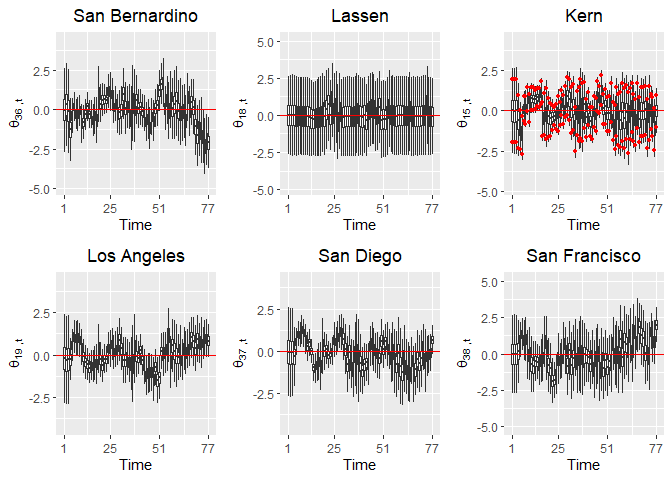
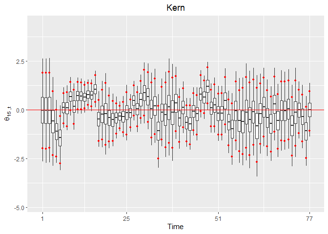

```{=html}
<script type="text/x-mathjax-config">
MathJax.Hub.Config({
  TeX: { 
      equationNumbers: {
 
            autoNumber: "all",
            formatNumber: function (n) {return +n}
      } 
  }
});
</script>
```


# Compiling and Running via cmdSTAN in UBUNTU
The first step in compiling our program is to navigate to the cmdstan file. 

```bash
cd /home/admin/cmdstan
```

We then have cmdstan turn our modelA1 into an executable program via the make command.


```bash
make /home/admin/Desktop/research/modelA1
```

Navigate to the folder where the modelA1.STAN has an executable file under the name modelA1.


```bash
cd /home/admin/Desktop/research/
```

While remaining in the same location, we instruct cmdstan to create 3 MCMC chains to run in parallel, do a 50,000 set of warmup simulations and sample 10,000 from them. The data is specified as '2023noICUcoviddata1.r' and the output files will be specified as mA11 with its extensions specified as _i leading to the file names mA11_1,mA11_2, and mA11_3. The execution of the model took approximately 9 hrs in hour workstation.


```bash
for i in {1..3}; do ./modelA1 sample num_warmup=50000
num_samples=10000 data file=./2023noICUcoviddata1.r 
output file output file=mA11_${i} &done&
```

# Reading the files and checking convergence

In this section we will read in the csv files and check for convergence. Note that the mA11_1,mA11_2 and mA11_3 do not have file extensions so we added them for convenience. The model created these large files and they will take a large RAM capacity in your R session.   


```r
#Loading the libraries and specifying the options to use multiple cores as needed
options(mc.cores=parallel::detectCores(),auto_write = TRUE)
library(rstan)
library(xtable)
library(ggspatial)
library(ggplot2)
library(viridis)
setwd("C:/Users/rm84/Desktop/research/HMM/data")
load("workspacewithbasedata.RData")
#Specifying the location of the csv files and creating string objects

chain1='C:/Users/rm84/Documents/mA11_1.csv'
chain2='C:/Users/rm84/Documents/mA11_2.csv'
chain3='C:/Users/rm84/Documents/mA11_3.csv'
```

To check for convergence we read in the csv files and obtain summary information of the MCMC samples. There is a good discussion on why we should not focus only on Rhat^[https://statmodeling.stat.columbia.edu/2019/03/19/maybe-its-time-to-let-the-old-ways-die-or-we-broke-r-hat-so-now-we-have-to-fix-it/] however we know that if Rhat is over 1.01 we definitely do not have a well mixed model. We show here that there were no parameters with an Rhat over 1.01 and proceed to also highlight the similarity between the observed mortality data and the generated values.  


```r
csvfiles=c(chain1,chain2,chain3)
fit=read_stan_csv(csvfiles)
fitsummary=summary(fit)$summary

Rhats=fitsummary[,"Rhat"]

sum(Rhats>1.01,na.rm=TRUE)
```

```
## [1] 0
```

```r
Rhats[Rhats>1.01]
```

```
## named numeric(0)
```

# Converting the samples to R object

We proceed to extract all the samples into the object listofdraws, remove the stan fit object, use the garbage collection gc() function to release RAM. Attaching the listofdraws allow us to refer to the parameters directly. 


```r
listofdraws=as.data.frame(rstan::extract(fit))
rm(fit)
gc()
```

```
##             used   (Mb) gc trigger    (Mb)   max used    (Mb)
## Ncells   1333755   71.3    2467660   131.8    2467660   131.8
## Vcells 428685557 3270.7 1427136382 10888.2 1311365496 10005.0
```

```r
#rho 
attach(listofdraws)
```

# Obtaining Root Mean Square Error and DIC4

The list of lists, object named 'cadata', contain all the data that our model have used. We will first obtain the root mean square error in rMSE object. We are going to utilize the $DIC_4$ framework from @celeux06 to calculate the fit our model to compare to others later. The result is contained in the object ll which we report.     


```r
source("C:/Users/rm84/Desktop/research/HMM/data/R2023noICUcoviddata1.r")
START=1
END=77
ITER=END-START+1
cadata$START=START
cadata$END=END

meansoflambda=array(dim=c(ITER,length=N))
for(t in START:END){
  for(n in 1:N){
    meansoflambda[t-START+1,n]=mean(eval(parse(text=(paste0("alpha.",t-START+1,".",1,".",n)))))
  }}

MSEarray=array(dim=c(ITER))
for(t in START:END){
  MSEarray[t-START+1]=mean((cadata$y[t,]-meansoflambda[t-START+1,])^2)
}
MSE=mean(MSEarray)
rMSE=sqrt(MSE)

rMSE
```

```
## [1] 1.660921
```

```r
START=1
END=77
l=length(alpha.1.1.1)
ll1=array(dim=c(l,(END-START+1),N))
for(t in START:END){
  for(n in 1:N){
    ll1[,t,n]=dpois(y[t,n],lambda=eval(parse(text=(paste0("alpha.",t-START+1,".",1,".",n)))),log=TRUE)
  }}

ll2=matrix(nrow=(END-START+1),ncol=N)
for(t in START:END){
  for(n in 1:N){
    ll2[t,n]=dpois(y[t,n],lambda=mean(eval(parse(text=(paste0("alpha.",t-START+1,".",1,".",n))))),log=TRUE)
  }}


ll=-4*mean(rowSums(ll1))+2*sum(ll2)

ll
```

```
## [1] 17724.42
```

# Analysis of parameters
This section will discuss the findings associated with modelA1. We will first discuss the fixed parameters of interest associated with the covariates. We will follow that with a discussion of coefficients of Vaccinations through $t=1 \ldots t=77$. We proceed to discuss $\phi$ and $\theta$ terms. 

## Parameters of Fixed Covariates


```r
summary1=xtable(summary((cbind.data.frame(beta_pov,
beta_inc,beta_dens,beta_gini,beta_white,beta_age,beta_sex))))

s1=(as.data.frame(cbind(beta_pov,beta_inc,beta_dens,beta_gini,
beta_white,beta_age,beta_sex)))

m1=as.data.frame(matrix(data=s1,nrow=6,ncol=7))

  m1[1,]=round(sapply(s1,min),3)
  m1[2,]=round(apply(s1[1:7],2,quantile,probs=0.025),3)
  m1[3,]=round(sapply(s1,median),3)
  m1[4,]=round(colMeans(s1),3)
  m1[5,]=round(apply(s1[1:7],2,quantile,probs=0.975),3)
  m1[6,]=round(sapply(s1,max),3)
  row.names(m1) = c("Min","2.5th Perc.","Med.","Mean","97.5th Perc.","Max")
knitr::kable(m1,
col.names = c("$\\beta_{Pov}$","$\\beta_{Inc}$","$\\beta_{Dens}$","$\\beta_{gini}$","$\\beta_{white}$","$\\beta_{age}$","$\\beta_{sex}$"),
escape=FALSE)
```


|             |$\beta_{Pov}$ |$\beta_{Inc}$ |$\beta_{Dens}$ |$\beta_{gini}$ |$\beta_{white}$ |$\beta_{age}$ |$\beta_{sex}$ |
|:------------|:-------------|:-------------|:--------------|:--------------|:---------------|:-------------|:-------------|
|Min          |-0.054        |-0.328        |0.025          |-0.152         |0.36            |-0.023        |-0.258        |
|2.5th Perc.  |0.017         |-0.248        |0.074          |-0.097         |0.677           |0.044         |-0.181        |
|Med.         |0.089         |-0.161        |0.112          |-0.041         |0.985           |0.122         |-0.113        |
|Mean         |0.089         |-0.162        |0.112          |-0.042         |0.984           |0.122         |-0.114        |
|97.5th Perc. |0.162         |-0.075        |0.149          |0.013          |1.289           |0.201         |-0.049        |
|Max          |0.231         |0.009         |0.184          |0.068          |1.678           |0.278         |0.014         |
As can be seen from the table's $95\%$ credibility intervals increased poverty, density, percentage of people who are white, median age leads to increased mortality risk. On the other hand increased income and males to females ratio in the county decreases mortality risk. When we control for all the covariates, Gini covariate coefficient contains the value 0 in the $95\%$ credibility interval.

## Parameters of Vaccination Coefficients

As can be demonstrated from the plot in this section we can clearly see that in most of 2021 the vaccinations decreased mortality risk in the counties of california. The only biweek where vaccinations in the counties of California had a positive relationship to mortality risk is in biweek 62 which is in 2022. For all of the rest of 2022 the credibility interval contains 0. This acquires more attention and could be due to the vaccinations losing their effectiveness and most of the population having some degree of protection. As both the disease and the vaccinations are evolving we would need to pay close attention to the dynamic nature of these effects. In fact we argue that we should be looking at more changes in the fixed covariates' effect through the biweeks.     


```r
library(ggpubr)
library(dplyr)
library(gridExtra)

V=cadata$V
qhigh=array(dim=c(T-V+1))
qlow=array(dim=c(T-V+1))
beta_vac=as.data.frame(matrix(nrow=(T-V+1)*l,ncol=2))
V=cadata$V
qhigh=array(dim=c(T-V+1))
qlow=array(dim=c(T-V+1))
beta_vac=as.data.frame(matrix(nrow=(T-V+1)*l,ncol=2))
for(i in 1:(T-V+1)){
  beta_vac[((i-1)*(l)+1):((i)*l),1]=eval(parse(text=(paste0("beta_vac.",i))))
  beta_vac[((i-1)*(l)+1):((i)*l),2]=i
  qhigh[i]=quantile(eval(parse(text=(paste0("beta_vac.",i)))),0.975)
  qlow[i]=quantile(eval(parse(text=(paste0("beta_vac.",i)))),0.025)
}
names(beta_vac)=c("beta_vac","Biweeks")

qhigh_data <- beta_vac %>%
  group_by(Biweeks) %>%
  summarise(qhigh = quantile(beta_vac,0.975))

qlow_data <- beta_vac %>%
  group_by(Biweeks) %>%
  summarise(qlow = quantile(beta_vac,0.025))

  beta_vacplot=ggplot(data = beta_vac,aes(x= Biweeks, y = beta_vac,group=Biweeks))+
  geom_boxplot(outlier.shape = NA)+scale_y_continuous(name=bquote(beta[vac]))+ggtitle(bquote(beta[vac] ~ "from t=1...64"))+theme(plot.title = element_text(hjust = 0.5))+
  geom_hline(yintercept=0.0, linetype="solid", color = "red") +
  scale_x_continuous(name="Time",labels=c('25','29','34','39','44','49','54','59','64','69','74','77'),breaks=c(1,5,10,15,20,25,30,35,40,45,50,55))+
    stat_summary(data = qhigh_data, 
                 aes(x = Biweeks, y = qhigh),
                 geom = "point", 
                 size = 1, 
                 color = "red")+
    stat_summary(data = qlow_data, 
                 aes(x = Biweeks, y = qlow),
                 geom = "point", 
                 size = 1, 
                 color = "red")
beta_vacplot
```

<figure><figcaption></figcaption></figure>

```r
#Number of biweeks where 0 is above the Credibility Interval  
num_biweeks_CI_neg<-sum(0<qlow_data$qlow)   
num_biweeks_CI_neg
```

```
## [1] 1
```

```r
#What were the biweeks where 0 is above the Credibility Interval 
which(0<qlow_data$qlow)+V
```

```
## 2.5% 
##   63
```

```r
#Number of biweeks where 0 is below the Credibility Interval
num_biweeks_CI_pos<-sum(0>qhigh_data$qhigh)
num_biweeks_CI_pos
```

```
## [1] 28
```

```r
#What were the biweeks where 0 is below the Credibility Interval
which(0>qhigh_data$qhigh)+V
```

```
## 97.5% 97.5% 97.5% 97.5% 97.5% 97.5% 97.5% 97.5% 97.5% 97.5% 97.5% 97.5% 97.5% 
##    30    31    32    33    34    35    36    37    38    39    40    41    42 
## 97.5% 97.5% 97.5% 97.5% 97.5% 97.5% 97.5% 97.5% 97.5% 97.5% 97.5% 97.5% 97.5% 
##    43    44    45    46    47    48    49    50    51    52    53    55    56 
## 97.5% 97.5% 
##    57    58
```
## $\theta$, Random Effect Coefficients of Counties

We proceed to illustrate the random effects of counties. It is not surprising that for most counties, what can be referred to as the county performance varies across the biweeks per county.    


```r
library(ggpubr)
library(gridExtra)
cnames<-read.table("C:/Users/rm84/Desktop/research/HMM/data/countynames.txt",sep="\t",header=TRUE)[,1]
M=ITER*length(theta.1.15)
l=length(theta.1.15)
theta15=as.data.frame(matrix(nrow=M,ncol=2))
n=15
for(t in 1:ITER){
  theta15[((t-1)*(l)+1):((t)*l),1]=eval(parse(text=(paste0("theta.",t,".",n))))
  theta15[((t-1)*(l)+1):((t)*l),2]=t
}
#theta15[,2]=as.character(theta15[,2])
names(theta15)=c("theta","Biweeks")


theta18=as.data.frame(matrix(nrow=M,ncol=2))
n=18
for(t in 1:ITER){
  theta18[((t-1)*(l)+1):((t)*l),1]=eval(parse(text=(paste0("theta.",t,".",n))))
  theta18[((t-1)*(l)+1):((t)*l),2]=t
}

names(theta18)=c("theta","Biweeks")

theta36=as.data.frame(matrix(nrow=M,ncol=2))
n=36
for(t in 1:ITER){
  theta36[((t-1)*(l)+1):((t)*l),1]=eval(parse(text=(paste0("theta.",t,".",n))))
  theta36[((t-1)*(l)+1):((t)*l),2]=t
}

names(theta36)=c("theta","Biweeks")


#################################################
theta19=as.data.frame(matrix(nrow=M,ncol=2))
n=19
for(t in 1:ITER){
  theta19[((t-1)*(l)+1):((t)*l),1]=eval(parse(text=(paste0("theta.",t,".",n))))
  theta19[((t-1)*(l)+1):((t)*l),2]=t
}

names(theta19)=c("theta","Biweeks")

theta37=as.data.frame(matrix(nrow=M,ncol=2))
n=37
for(t in 1:ITER){
  theta37[((t-1)*(l)+1):((t)*l),1]=eval(parse(text=(paste0("theta.",t,".",n))))
  theta37[((t-1)*(l)+1):((t)*l),2]=t
}

names(theta37)=c("theta","Biweeks")

theta38=as.data.frame(matrix(nrow=M,ncol=2))
n=38
for(t in 1:ITER){
  theta38[((t-1)*(l)+1):((t)*l),1]=eval(parse(text=(paste0("theta.",t,".",n))))
  theta38[((t-1)*(l)+1):((t)*l),2]=t
}

names(theta38)=c("theta","Biweeks")
############################################################################################
la=ggplot(data = theta19,aes(x= Biweeks, y = theta,group=Biweeks))+
  geom_boxplot(outlier.shape = NA)+ggtitle(cnames[19])+theme(plot.title = element_text(hjust = 0.5))+
  geom_hline(yintercept=0, linetype="solid", color = "red")+scale_y_continuous(name=bquote(theta[19~",t"]))+
  scale_x_continuous(name="Time",labels=c('1','25','51','77'),breaks=c(1,25,51,77))

sd=ggplot(data = theta37,aes(x= Biweeks, y = theta,group=Biweeks))+
  scale_y_continuous(name=bquote(theta))+
  geom_boxplot(outlier.shape = NA)+ggtitle(cnames[37])+theme(plot.title = element_text(hjust = 0.5))+
  geom_hline(yintercept=0, linetype="solid", color = "red")+scale_y_continuous(name=bquote(theta[37~",t"]))+
  scale_x_continuous(name="Time",labels=c('1','25','51','77'),breaks=c(1,25,51,77))

sf=ggplot(data = theta38,aes(x= Biweeks, y = theta,group=Biweeks))+
  scale_y_continuous(name=bquote(theta))+
  geom_boxplot(outlier.shape = NA)+ggtitle(cnames[38])+theme(plot.title = element_text(hjust = 0.5))+
  geom_hline(yintercept=0, linetype="solid", color = "red")+scale_y_continuous(name=bquote(theta[38~",t"]))+
  scale_x_continuous(name="Time",labels=c('1','25','51','77'),breaks=c(1,25,51,77))

#######################################################################################

Lassen=ggplot(data = theta18,aes(x= Biweeks, y = theta,group=Biweeks))+
  geom_boxplot(outlier.shape = NA)+ggtitle(cnames[18])+theme(plot.title = element_text(hjust = 0.5))+
  geom_hline(yintercept=0, linetype="solid", color = "red")+ylim(-5,5)+scale_y_continuous(name=bquote(theta[18~",t"]))+
  scale_x_continuous(name="Time",labels=c('1','25','51','77'),breaks=c(1,25,51,77))
Kern=ggplot(data = theta15,aes(x= Biweeks, y = theta,group=Biweeks))+
  geom_boxplot(outlier.shape = NA)+ggtitle(cnames[15])+theme(plot.title = element_text(hjust = 0.5))+
  geom_hline(yintercept=0, linetype="solid", color = "red")+ylim(-5,5)+
  scale_y_continuous(name=bquote(theta[15~",t"]))+
  scale_x_continuous(name="Time",labels=c('1','25','51','77'),breaks=c(1,25,51,77))
sbern=ggplot(data = theta36,aes(x= Biweeks, y = theta,group=Biweeks))+
  geom_boxplot(outlier.shape = NA)+ggtitle(cnames[36])+theme(plot.title = element_text(hjust = 0.5))+
  geom_hline(yintercept=0, linetype="solid", color = "red")+ylim(-5,5)+
  scale_y_continuous(name=bquote(theta[36~",t"]))+
  scale_x_continuous(name="Time",labels=c('1','25','51','77'),breaks=c(1,25,51,77))


grid.arrange(sbern,Lassen,Kern,la,sd,sf,nrow=2)
```

<figure><figcaption></figcaption></figure>

## The joint distribution $\phi$ 
When we look at the joint distribution of spatial contribution to mortality risk, out of the 


```r
phis=as.data.frame(matrix(nrow=N*l,ncol=2))

for(n in 1:N){
  phis[((n-1)*(l)+1):((n)*l),1]=eval(parse(text=(paste0("phi.",n))))
  phis[((n-1)*(l)+1):((n)*l),2]=n
}

names(phis)=c("phi","County_Index")

ggplot(data = phis,aes(x= County_Index, y = phi,group=County_Index))+
  geom_boxplot(outlier.shape = NA)+scale_y_continuous(name=bquote(phi))+
  scale_x_discrete(limits = c(1,5,10,15,20,25,30,35,40,45,50,55,58))+
  ggtitle("County Spatial Effects")+theme(plot.title = element_text(hjust = 0.5))+
  geom_hline(yintercept=0, linetype="solid", color = "red")+
  annotate("text", x = 18, y = -1.5, label = cnames[18])+
  annotate("segment", color="red", x=19, xend = 18, y=-1.45, 
           yend=quantile(phi.18,0.25), arrow=arrow(length=unit(0.2,"cm")))+
  
  annotate("text", x = 20, y = 2.1, label = cnames[19])+
  annotate("segment", color="red", x=20, xend = 19, y=2, 
           yend=quantile(phi.19,0.75), arrow=arrow(length=unit(0.2,"cm")))+
  
  annotate("text", x = 37, y = 1.5, label = cnames[38])+
  annotate("segment", color="red", x=37, xend = 38, y=1.45, 
           yend=quantile(phi.38,0.75), arrow=arrow(length=unit(0.2,"cm")))+
  
   annotate("text", x = 32, y = -0.55, label = cnames[37])+
  annotate("segment", color="red", x=31, xend = 37, y=-0.5, 
           yend=quantile(phi.37,0.25), arrow=arrow(length=unit(0.2,"cm")))+
  
  annotate("text", x = 33, y = 1.75, label = cnames[36])+
  annotate("segment", color="red", x=33, xend = 36, y=1.7, 
           yend=quantile(phi.36,0.75), arrow=arrow(length=unit(0.2,"cm")))+
  
        annotate("text", x = 12, y = 1.1, label = cnames[15])+
  annotate("segment", color="red", x=12, xend = 15, y=1.1, 
           yend=quantile(phi.15,0.75), arrow=arrow(length=unit(0.2,"cm")))
```

<figure><figcaption></figcaption></figure>

```r
phi_means=aggregate(.~County_Index,data=phis,mean)


ggplot() +
  annotation_spatial(shapeanddata) +
  ggtitle(bquote("Posterior Mean of "~phi~" s"))+
  theme(plot.title = element_text(hjust = 0.5))+
  layer_spatial(shapeanddata, aes(fill = (phi_means$phi)))+
  theme(legend.title= element_blank())+
  labs(fill =bquote(phi) )+scale_fill_viridis(limits = c(-2,2),direction=-1)+
  theme(legend.position = "none")
```

<figure><figcaption></figcaption></figure>

## $\rho$ Coefficient Structured vs Unstructured Errors

```r
rhos=as.data.frame(matrix(nrow=M,ncol=2))
l=length(rho.1)
for(n in 1:ITER){
  rhos[((n-1)*(l)+1):((n)*l),1]=eval(parse(text=(paste0("rho.",n))))
  rhos[((n-1)*(l)+1):((n)*l),2]=n
}

names(rhos)=c("rho","Biweeks")

ggplot(data = rhos,aes(x= Biweeks, y = rho,group=Biweeks))+
  geom_boxplot(outlier.shape = NA)+scale_y_continuous(name=bquote(rho[t]))+
  geom_hline(yintercept=0.5, linetype="solid", color = "red") +
  scale_x_continuous(name="Time",
  labels=c('1','5','10','15','20','25','30','35','40','45','50',
'55','60','65','70','75','77'),breaks=c(1,5,10,15,20,25,30,35,40,45,50,
55,60,65,70,75,77))+ggtitle("Spat. Structured vs Uncorrelated Error")+
  theme(plot.title = element_text(hjust = 0.5))
```

<figure><figcaption></figcaption></figure>

## $\sigma$ Overall standard deviation


```r
sigmas=as.data.frame(matrix(nrow=M,ncol=2))
l=length(rho.1)
for(n in 1:ITER){
  sigmas[((n-1)*(l)+1):((n)*l),1]=eval(parse(text=(paste0("sigma.",n))))
  sigmas[((n-1)*(l)+1):((n)*l),2]=n
}

names(sigmas)=c("sigma","Biweeks")

ggplot(data = sigmas,aes(x= Biweeks, y = sigma,group=Biweeks))+
  geom_boxplot(outlier.shape = NA)+scale_y_continuous(name=bquote(sigma[t]))+
  ggtitle("Overall Standard Deviation of Errors")+
  theme(plot.title = element_text(hjust = 0.5))+
  scale_x_continuous(name="Time",
                     labels=c('1','5','10','15','20','25','30','35',
                              '40','45','50','55','60','65','70','75','77'),breaks=c(1,5,10,15,20,25,30,35,
                                                                                     40,45,50,55,60,65,70,75,77))
```

<figure><figcaption></figcaption></figure>

## Convolution


```r
cv=matrix(nrow=ITER,ncol=N)
for(n in 1:N){
for(t in 1:ITER){
cv[t,n]=mean(
  ((sqrt(eval(parse(text=(paste0("rho.",t))))/scaling_factor))*eval(parse(text=(paste0("phi.",n))))+
  (sqrt(1-eval(parse(text=(paste0("rho.",t))))))*eval(parse(text=(paste0("theta.",t,".",n)))))*
  eval(parse(text=(paste0("sigma.",t))))
)
}}

convolution1=as.data.frame(matrix(nrow=6*ITER,ncol=3))
the6counties=c(19,37,38,18,15,36)
for(i in 1:6){
  convolution1[((i-1)*ITER+1) :((i-1)*ITER+ITER),1]=cv[,the6counties[i]]
  convolution1[((i-1)*ITER+1) :((i-1)*ITER+ITER),2]=rep(cnames[the6counties[i]],ITER)
  convolution1[((i-1)*ITER+1) :((i-1)*ITER+ITER),3]=c(1:ITER)
}
names(convolution1)=c("Convolution","County_Names","Biweeks")

ggplot(data = convolution1,aes(x= Biweeks, y = Convolution,group=County_Names))+
  geom_line(aes(color=County_Names,linetype=County_Names))+
  geom_hline(yintercept=0, linetype="solid", color = "red")+labs(y=bquote(sigma[t]*nu[i*","*t]))+
  annotate("text", x =which.min(convolution1[convolution1[,2]==cnames[38],1])-.25, 
           y =min(convolution1[convolution1[,2]==cnames[38],1])-.05, label = cnames[38])+
  annotate("text", x = which.max(convolution1[convolution1[,2]==cnames[19],1])-.75, 
           y =max(convolution1[convolution1[,2]==cnames[19],1])+.05, label = cnames[19])+
  annotate("text", x = which.min(convolution1[convolution1[,2]==cnames[37],1])-.25, 
           y =min(convolution1[convolution1[,2]==cnames[37],1])-.05, label = cnames[37])+
  annotate("text", x = which.max(convolution1[convolution1[,2]==cnames[36],1])-.25, 
           y =max(convolution1[convolution1[,2]==cnames[36],1])+.05, label = cnames[36])+
  annotate("text", x = which.min(convolution1[convolution1[,2]==cnames[15],1])-.25, 
           y =min(convolution1[convolution1[,2]==cnames[15],1])-.05, label = cnames[15])+
  annotate("text", x = which.max(convolution1[convolution1[,2]==cnames[18],1])-.25, 
           y =max(convolution1[convolution1[,2]==cnames[18],1])-.05, label = cnames[18])+
scale_x_continuous(name="Time",labels=c('1','5','10','15','20','25','30','35','40','45','50','55','60','65','70','75','77'),
breaks=c(1,5,10,15,20,25,30,35,40,45,50,55,60,65,70,75,77))+ggtitle("Convolution")+theme(plot.title = element_text(hjust = 0.5))
```

<figure><figcaption></figcaption></figure>

# References


