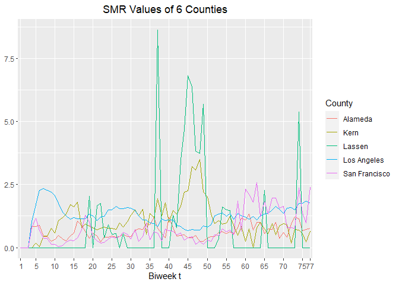

<script type="text/x-mathjax-config">
MathJax.Hub.Config({
  TeX: { 
      equationNumbers: {
 
            autoNumber: "all",
            formatNumber: function (n) {return +n}
      } 
  }
});
</script>


We had already discussed the [Hidden Markov Models](https://mmusal.github.io/blog/2023/Hidden-Markov-Models/). In this post we will discuss the details of the STAN model as well as the details we skipped in the above post.

We make use of two main sources and apply it to our context.\

1) Luis Damiano https://luisdamiano.github.io/stancon18/hmm_stan_tutorial.pdf\

2) Jim Savage https://khakieconomics.github.io/2018/02/24/Regime-switching-models.html\


Load the libraries, and read in the [SMR data](https://mmusal.github.io/blog/2023/Explaining_rshinyapp/#SMR). 

```r
library(ggplot2)
library(tidyr)
library(dplyr)
#E is calculated at every biweek and is the expected number of deaths if
#mortality was uniformly distributed across the population in the state of California
SMR=read.csv(file='SMR.csv',header = TRUE)[,-1]
#First 6 rows
head(SMR)
```

```
##   Time    County SMR
## 1    1   Alameda   0
## 2    1    Alpine   0
## 3    1    Amador   0
## 4    1     Butte   0
## 5    1 Calaveras   0
## 6    1    Colusa   0
```

```r
#Subset the data using dplyr
SMRSubset=SMR %>% filter(County %in% 
c("Alameda","Lassen","Kern","Los Angeles",
"Lassen","San Francisco"))

#Visualize 6 counties of interest.
ggplot(data=SMRSubset,aes(x=Time,y=SMR,color=County))+
geom_line()+  
  theme(legend.position = "right")+
  theme(axis.title.y =element_blank())+
  scale_x_discrete(limits=c(1,5,10,15,20,25,30,35,40,45,50,55,60,65,70,75,77))+
  xlab("Biweek t")+
  ggtitle("SMR Values of 6 Counties")+
  theme(plot.title = element_text(hjust = 0.5))
```

<!-- -->

In this snippet we provide the data structure for compilation by STAN.


The parameters of the model is defined here including the priors. 

```stan
parameters {
ordered[K] mu[N]; 
```
We will have 2 mu values for each County such that mu_{i,1}<mu_{i,2}, the ordering is neccessary for the identifiability of the parameters. Othwerise the distribution of $\mu$ would create problems of convergence. 


This is where we define the steps to calculate the joint probabilities note the dimensions of the objects. Logalpha contains joint probabilities of data and regime.

```stan
transformed parameters {
matrix[K,N] lambda [T] ;
real logalpha[T,K,N];
real accumulator[K];
    for(t in 1:T){
  for(k in 1:K){     
    for(n in 1:N){
      lambda[t][k,n]=exp( //Covid-19 mean and variance of k'th regime n'th county at time t.
        log_E[t,n]+mu[n,k]+epsilon[t]); //since lambda is the exponential of the linear equation lambda is  E[t,n]*exp(mu[n,k]+epsilon[t])
                }
              }
                }
for(k in 1:K){
  for(n in 1:N){
logalpha[1,k,n] = log(pi1[1,k]) + poisson_lpmf(y[1,n] | lambda[1,k,n]);
}
}
```
lambda contains the information of regime but also other information
we will ignore that notation for brevity
$logalpha_{1,k=1,n}=log(P(k_{1})=1)*P(y_{1,n}|\lambda_{1,1,n})$
$=P(y_{1,n},k_{1}=1)$
$logalpha_{1,k=2,n}=log(P(k_{1})=2)*P(y_{1,n}|\lambda{1,2,n})$
$=P(y_{1,n},k_{1}=2)$

Continuing with the transformed parameters.
Let us focus on an iteration at t=2, j=1 within the loop for n

```stan
for (t in 2:T) {
for (j in 1:K) {
for (n in 1:N){
accumulator[1] = logalpha[t-1, 1,n] + log(A[1, n,j]) + poisson_lpmf(y[t,n] | lambda[t,j,n]);
```

This is evaluating:
$accumulator_{1}=$\
$log(P(y_{1,n},k_{1}=1)*P(k_{2}=1|k_{1}=1)*P(y_{2,n}|\lambda_{2,1,n}))$\
This is equivalent to \
$log(P(y_{1,n},k_{1}=1,k_{2}=1)*P(y_{2,n}|\lambda_{2,1,n}))$\
$P(y_{1,n},k_{1}=1,k_{2}=1,y_{2,n})$\


```stan
accumulator[2] = logalpha[t-1, 2,n]+log(A[2, n,j])+poisson_lpmf(y[t,n] |lambda[t,j,n]);
```
using the same set of operations we calculate the other other joint probability.\
$accumulator_{2}=$\
$log(P(y_{1,n},k_{1}=2,k_{2}=1,y_{2,n}))$\


```stan
logalpha[t, j,n] = log_sum_exp(to_vector(accumulator))
}
}
}
;
```

Once you take the exp and sum the operations that occur:\
$P(y_{1,n},k_{1}=1,k_{2}=1,y_{2,n})+$\
$P(y_{1,n},k_{1}=2,k_{2}=1,y_{2,n})$\
and therefore you obtain in logalpha[2, 1,n]\
$=P(y_{1,n},k_{2}=1,y_{2,n})$
After j=1 is complete and when j=2 and t is still at 2
$=P(y_{1,n},k_{2}=2,y_{2,n})$
so in general at time T
$P(y_{1,n},...,y_{T,n},k_{T}=1)$ and 
$P(y_{1,n},...,y_{T,n},k_{T}=2)$


```stan
model {

for(n in 1:N){  
 target += log_sum_exp(to_vector(logalpha[T,1:K,n]));
```
This is going to evaluate the last joint probability
the rest being evaluated in the transformed parameters.
According to Luis Damio's conference paper the above is enough
to compute the likelihood I am testing it out right now
$P(y_{1,n},...,y_{T,n},k_{T}=1)$ and \
$P(y_{1,n},...,y_{T,n},k_{T}=2)$\
$log(P(y_{1,n},...,y_{T,n},k_{T}=1)+P(y_{1,n},...,y_{T,n},k_{T}=2))$\
$log(P(y_{1,n},...,y_{T,n}))$\


The priors are listed below


```stan
  mu[n]~normal(0,3);

}

epsilon~normal(0,3);
}

```

The priors given by simplex is Dirichlet [1,1]
https://discourse.mc-stan.org/t/default-prior-for-simplex/9748
ordered parameters are discussed
https://betanalpha.github.io/assets/case_studies/identifying_mixture_models.html#43_breaking_the_labeling_degeneracy_by_enforcing_an_ordering
log likelihood is listed on table 1
https://luisdamiano.github.io/stancon18/hmm_stan_tutorial.pdf
