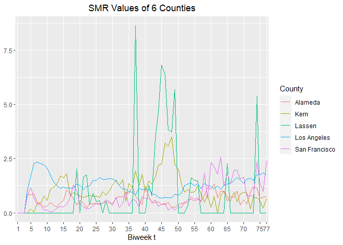

<script type="text/x-mathjax-config">
MathJax.Hub.Config({
  TeX: { 
      equationNumbers: {
 
            autoNumber: "all",
            formatNumber: function (n) {return +n}
      } 
  }
});
</script>


We had already discussed the [Hidden Markov Models](https://mmusal.github.io/blog/2023/Hidden-Markov-Models/). In this post we will discuss the details of the STAN model as well as the details we skipped in the above post.

Load the libraries, and read in the [SMR data](https://mmusal.github.io/blog/2023/Explaining_rshinyapp/#SMR). 

```r
library(ggplot2)
library(tidyr)
library(dplyr)
#E is calculated at every biweek and is the expected number of deaths if
#mortality was uniformly distributed across the population in the state of California
SMR=read.csv(file='SMR.csv',header = TRUE)[,-1]
#First 6 rows
head(SMR)
```

```
##   Time    County SMR
## 1    1   Alameda   0
## 2    1    Alpine   0
## 3    1    Amador   0
## 4    1     Butte   0
## 5    1 Calaveras   0
## 6    1    Colusa   0
```

```r
#Subset the data using dplyr
SMRSubset=SMR %>% filter(County %in% 
c("Alameda","Lassen","Kern","Los Angeles",
"Lassen","San Francisco"))

#Visualize 6 counties of interest.
ggplot(data=SMRSubset,aes(x=Time,y=SMR,color=County))+
geom_line()+  
  theme(legend.position = "right")+
  theme(axis.title.y =element_blank())+
  scale_x_discrete(limits=c(1,5,10,15,20,25,30,35,40,45,50,55,60,65,70,75,77))+
  xlab("Biweek t")+
  ggtitle("SMR Values of 6 Counties")+
  theme(plot.title = element_text(hjust = 0.5))
```

<!-- -->
